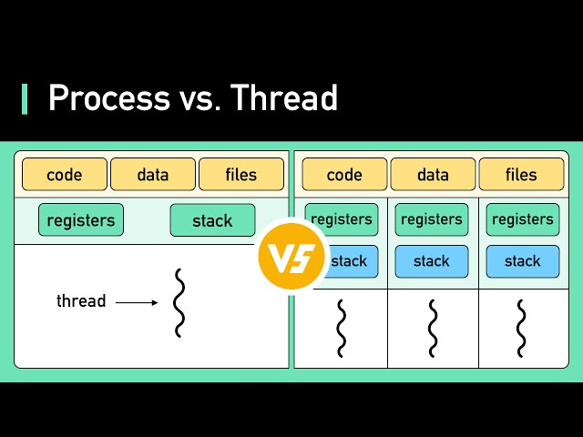
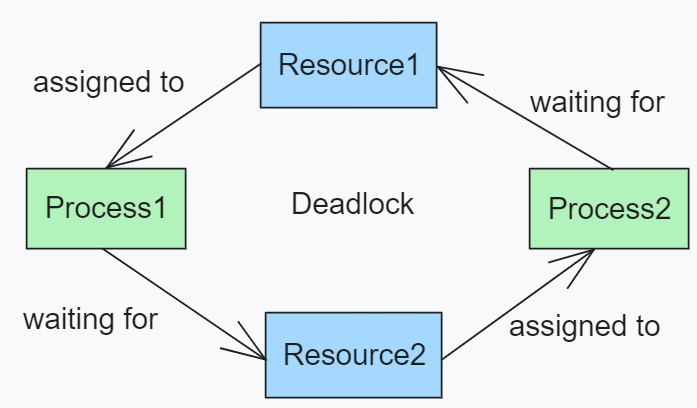

# **Chapter 10: Threads**

## Overview
This chapter introduces **threads**, a key concept in concurrent programming. Threads allow a process to perform multiple tasks simultaneously by sharing the same memory space. In Unix-based systems, threads are widely used for building responsive and efficient applications.

Key topics covered in this chapter include:

- What threads are and how they differ from processes
- Benefits and challenges of multithreading
- POSIX Threads (pthreads) API
- Creating, joining, and terminating threads
- Thread synchronization with mutexes and condition variables
- Common pitfalls and best practices

## What Are Threads?
A **thread** is a lightweight unit of execution within a process. All threads in a process share the same code, data, and heap segments but have separate stacks and registers.

### Threads vs. Processes
| Feature | Thread | Process |
|--------|--------|---------|
| Address Space | Shared | Separate |
| Creation Overhead | Low | High |
| Communication | Fast (shared memory) | Slow (IPC needed) |
| Failure Isolation | No | Yes |



## POSIX Threads (pthreads)
The POSIX standard provides a powerful API for thread programming in C. To use it, include the `pthread.h` header and link with the `-pthread` flag.

### Creating Threads
```c
#include <pthread.h>
#include <stdio.h>

void* say_hello(void* arg) {
    printf("Hello from thread!\n");
    return NULL;
}

int main() {
    pthread_t tid;
    pthread_create(&tid, NULL, say_hello, NULL);
    pthread_join(tid, NULL);
    return 0;
}
```

## Thread Synchronization
When multiple threads share data, synchronization is necessary to avoid race conditions.

### Mutex Example
```c
#include <pthread.h>
#include <stdio.h>

int counter = 0;
pthread_mutex_t lock;

void* increment(void* arg) {
    for (int i = 0; i < 10000; i++) {
        pthread_mutex_lock(&lock);
        counter++;
        pthread_mutex_unlock(&lock);
    }
    return NULL;
}

int main() {
    pthread_t t1, t2;
    pthread_mutex_init(&lock, NULL);
    pthread_create(&t1, NULL, increment, NULL);
    pthread_create(&t2, NULL, increment, NULL);
    pthread_join(t1, NULL);
    pthread_join(t2, NULL);
    printf("Counter: %d\n", counter);
    pthread_mutex_destroy(&lock);
    return 0;
}
```



## Condition Variables
Condition variables allow threads to wait for specific conditions to occur.

### Example: Producer-Consumer (Pseudo-code)
```c
pthread_mutex_t mutex;
pthread_cond_t cond;

pthread_mutex_lock(&mutex);
while (!condition_met)
    pthread_cond_wait(&cond, &mutex);
// Perform action
pthread_mutex_unlock(&mutex);
```

## Thread Lifecycle

1. **Creation**: `pthread_create()` starts a new thread.
2. **Execution**: Thread runs the specified function.
3. **Synchronization**: Use `pthread_join()` to wait for a thread to finish.
4. **Termination**: Thread returns or calls `pthread_exit()`.

## Common Pitfalls

- **Race conditions**: Unsynchronized access to shared data.
- **Deadlocks**: Threads wait on each other indefinitely.
- **Resource leaks**: Not joining or cleaning up threads properly.
- **Excessive thread creation**: Leads to overhead and performance issues.

## Interactive Quiz

1. What is a key difference between threads and processes?

    **A**. Threads have separate memory spaces<br>
    **B**. Threads share memory within a process<br>
    **C**. Threads are heavier than processes<br>

    ??? question "Show Answer"
        The correct answer is **B**. Threads share the same memory space, unlike processes.

2. Which function is used to create a new thread in POSIX?

    **A**. `fork()`<br>
    **B**. `pthread_create()`<br>
    **C**. `exec()`<br>

    ??? question "Show Answer"
        The correct answer is **B**. `pthread_create()` creates a new thread.

3. What is the purpose of a mutex?

    **A**. To execute threads in parallel<br>
    **B**. To avoid context switching<br>
    **C**. To ensure exclusive access to shared resources<br>

    ??? question "Show Answer"
        The correct answer is **C**. Mutexes prevent race conditions by allowing only one thread to access a resource at a time.

## Summary
- Threads enable concurrent execution within a process and share memory.
- Use `pthread_create()`, `pthread_join()`, and `pthread_exit()` to manage threads.
- Synchronize threads with mutexes and condition variables to prevent race conditions.
- Proper design and cleanup are essential to avoid concurrency bugs.

In the next chapter, we’ll explore **Process Scheduling and Synchronization**, covering how the operating system manages threads and processes for efficient multitasking.

---
*This chapter is based on material from "Advanced Programming in the UNIX Environment, Third Edition, by W. Richard Stevens and Stephen A. Rago, 2013."*

