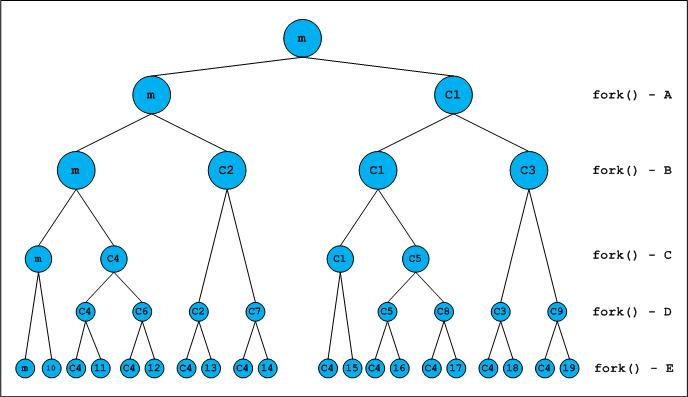
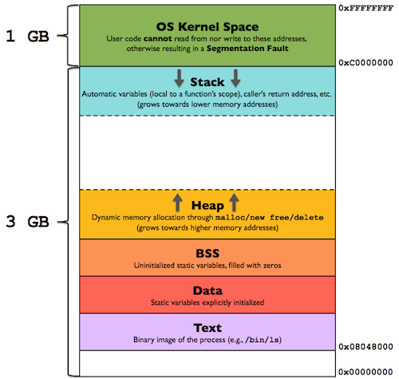

# **Chapter 1: Programs and Processes**

## Overview
This chapter introduces fundamental concepts related to programs and processes in Unix-based operating systems. Understanding the distinction between a program and a process is crucial for systems programming, as it forms the basis for process control, execution, and resource management in an operating system.

A **program** is a passive entity that consists of executable code stored on disk. When a program is executed, the operating system creates a **process**, which is an active instance of that program with its own memory space, execution context, and system resources.

Key topics covered in this chapter include:
- The difference between programs and processes
- The UNIX process model
- Process creation and termination
- Process memory layout
- System calls related to process management

## Programs vs. Processes
A program is a set of instructions stored in an executable file, while a process is an executing instance of a program. Multiple processes can be running from the same program, each with its own process ID (PID) and execution context. The operating system manages these processes, ensuring efficient CPU scheduling and resource allocation.

### Process States
A process transitions through several states during its execution:


1. **New** – The process is being created.
2. **Ready** – The process is waiting to be assigned to a CPU.
3. **Running** – The process is actively executing instructions.
4. **Blocked (Waiting)** – The process is waiting for an event (e.g., I/O completion).
5. **Terminated** – The process has finished execution or has been explicitly killed.

## The UNIX Process Model
UNIX systems follow a hierarchical process model where every process (except the initial process, often `init` or `systemd`) is created by another process. This relationship forms a **process tree**, where each process has a parent and may create child processes.



## Interactive MicroSim

Dive deeper into how `fork()`, `exec()`, `wait()`, and `exit()` affect the process tree with this interactive MicroSim:

👉 [Launch the Process Tree Simulator](../../sims/process-tree/main.html)


The primary system calls for process management in UNIX include:

- `fork()`: Creates a new child process by duplicating the parent.<br>
- `exec()`: Replaces the current process image with a new program.<br>
- `wait()`: Suspends execution of the parent until a child process terminates.<br>
- `exit()`: Terminates a process and returns a status to its parent.<br>

### Example: Creating a New Process
The `fork()` system call is fundamental in UNIX process creation. Below is a basic example in C:

```c
#include <stdio.h>
#include <unistd.h>

int main() {
    pid_t pid = fork();
    if (pid == 0) {
        printf("Child Process: PID = %d\n", getpid());
    } else {
        printf("Parent Process: PID = %d, Child PID = %d\n", getpid(), pid);
    }
    return 0;
}
```

### Process Memory Layout
Each process has a structured memory layout consisting of:



- **Text segment**: The executable code.
- **Data segment**: Global and static variables.
- **BSS (Block Started by Symbol)**: Uninitialized global and static variables.
- **Heap**: Dynamically allocated memory.
- **Stack**: Function call stack, containing local variables and return addresses.
- **Kernel space**: The portion of memory reserved for the operating system, which user processes do not have direct access to.

### Example: Executing a New Program
The `exec()` family of functions replaces a running process with a new program:

```c
#include <stdio.h>
#include <unistd.h>

int main() {
    printf("Executing ls command...\n");
    execl("/bin/ls", "ls", "-l", NULL);
    return 0;
}
```

## Process Termination
Processes can terminate in various ways:

- **Normal termination**: The process completes execution and calls `exit()`.<br>
- **Signal termination**: The process is terminated by a signal (e.g., `SIGKILL`).<br>
- **Parent-initiated termination**: A parent process can terminate its child using `kill()`.<br>

### Example: Waiting for Child Process Termination

```c
#include <stdio.h>
#include <sys/types.h>
#include <sys/wait.h>
#include <unistd.h>

int main() {
    pid_t pid = fork();
    if (pid == 0) {
        printf("Child Process\n");
    } else {
        wait(NULL);  // Parent waits for child to finish
        printf("Child Process Terminated\n");
    }
    return 0;
}
```

## Interactive Quiz
Test your understanding of process management concepts with this short quiz:

1. What is the main difference between a program and a process?

    **A**. A program is running, while a process is stored on disk.<br>
    **B**. A program is a passive entity, while a process is an executing instance of a program.<br>
    **C**. A program always creates exactly one process.<br>

    ??? question "Show Answer"
        The correct answer is **B**. A program is just a file containing executable code, but it does nothing on its own. When a program is executed, the operating system creates a process, which includes an allocated memory space, registers, and other runtime resources.

2. Which system call is used to create a new process in UNIX?

    **A**. `exec()`<br>
    **B**. `wait()`<br>
    **C**. `fork()`<br>

    ??? question "Show Answer"
        The correct answer is **C**. The `fork()` system call creates a new child process by duplicating the parent’s memory space. After a `fork()`, two processes exist: the parent and the newly created child.

3. What happens when a parent process calls `wait()`?

    **A**. It immediately terminates.<br>
    **B**. It waits for a child process to complete execution.<br>
    **C**. It duplicates itself.<br>

    ??? question "Show Answer"
        The correct answer is **B**. The `wait()` system call suspends the parent process until one of its child processes terminates, allowing the parent to retrieve the child’s exit status.

## Summary
- A **program** is an executable file, while a **process** is a running instance of a program.
- Processes undergo state transitions such as **ready, running, blocked, and terminated**.
- UNIX uses a **hierarchical process model**, where processes are created using `fork()` and executed with `exec()`.
- Process memory layout includes **text, data, heap, and stack** segments.
- Processes terminate normally with `exit()` or via signals from other processes.

Understanding these concepts is essential for working with process management in UNIX environments. The next chapter will delve deeper into **inter-process communication (IPC)** mechanisms such as signals, pipes, and shared memory.

---
*This chapter is based on material from "Advanced Programming in the UNIX Environment, Third Edition, by W. Richard Stevens and Stephen A. Rago, 2013."*
