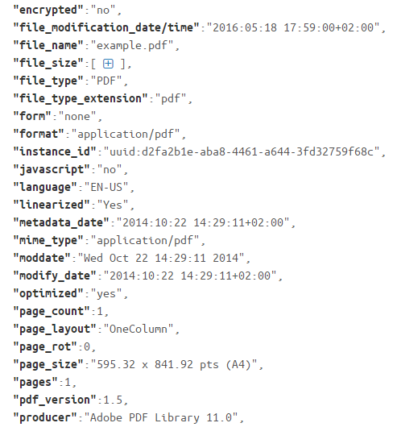
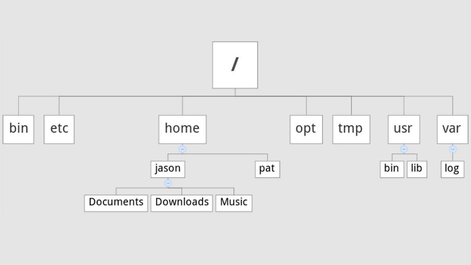
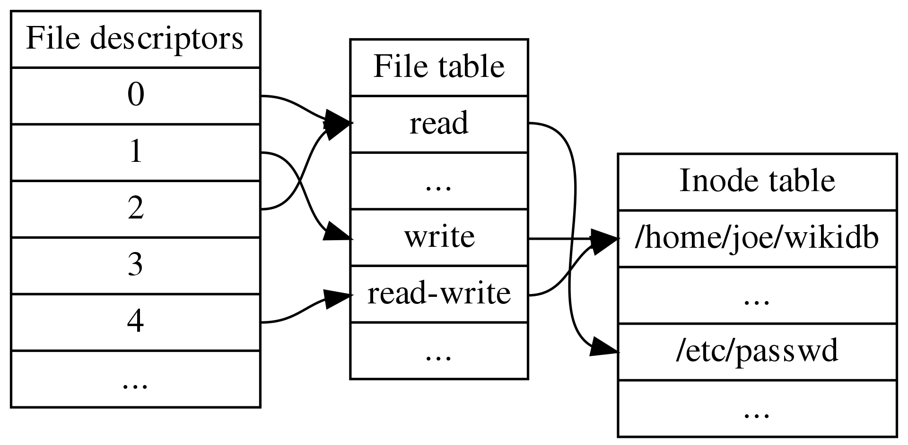
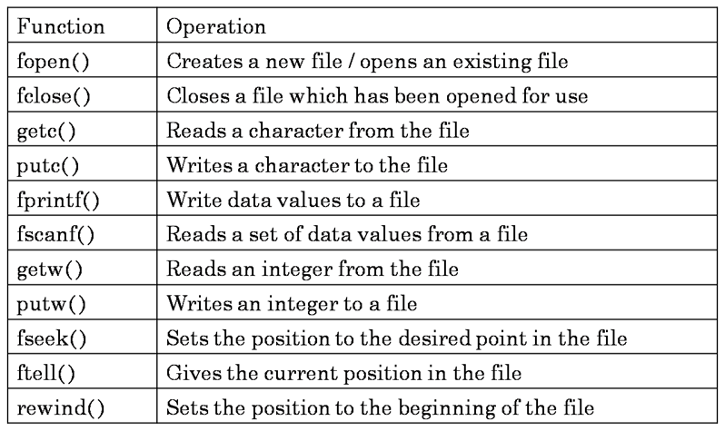

# **Chapter 3: File Systems**

## Overview
This chapter explores the fundamentals of file systems in Unix-based operating systems, covering their structure, organization, and essential system calls. File systems are critical for data storage, retrieval, and management, providing a structured way to store and access files efficiently.

Key topics covered in this chapter include:

- File system structure and organization
- File attributes and metadata
- Directory hierarchy and navigation
- File system types in Unix
- How files are stored and accessed
- System calls for file operations
- File permissions and access control

## File System Structure and Organization
A **file system** organizes data into files and directories, providing a hierarchical structure for efficient storage and retrieval. Unix file systems follow a **tree-like structure**, starting from the root directory (`/`).

### Key Components of a File System:
- **Files**: The basic unit of storage, containing data or executable code.
- **Directories**: Containers that group files and other directories.
- **Inodes**: Data structures that store metadata about files.
- **Superblock**: Contains metadata about the file system, including its size and structure.
- **Blocks**: The smallest units of storage allocated for files.

## File Attributes and Metadata
Each file in a Unix system has associated metadata stored in an **inode**. This metadata includes:
- **File type** (regular file, directory, symbolic link, etc.)
- **Permissions** (read, write, execute)
- **Owner and group**
- **Size (in bytes)**
- **Timestamps** (creation, modification, and access times)
- **Number of hard links**

### Viewing File Metadata
To view file attributes, use the `ls -l` command:
```sh
ls -l myfile.txt
```
Example File Metadata:



## Directory Hierarchy and Navigation
Unix file systems follow a hierarchical structure with a **single root directory** (`/`).



### Important Directories:
| Directory | Description |
|-----------|-------------|
| `/` | Root directory, contains all files and directories |
| `/home/` | User home directories |
| `/etc/` | System configuration files |
| `/var/` | Log files, temporary storage |
| `/tmp/` | Temporary files |
| `/dev/` | Device files |
| `/mnt/` | Mounted file systems |

### Navigation Commands:
```sh
cd /home/user   # Change directory
ls -l           # List directory contents
pwd             # Print current working directory
mkdir newdir    # Create a new directory
rmdir olddir    # Remove an empty directory
```

## How Files Are Stored and Accessed
Files in a Unix system are stored in **blocks** on a physical or virtual storage device. The file system manages how these blocks are allocated and retrieved.

### File Storage Process
1. **File Creation**: When a file is created, an inode is assigned to store metadata.
2. **Data Storage**: The actual file contents are divided into **blocks** and stored in available disk space.
3. **Indexing with Inodes**: The inode maintains a list of pointers to the blocks containing the file’s data.

### Accessing Files
When a file is accessed, the file system:

1. **Locates the inode** using the directory structure.
2. **Reads the inode metadata** to retrieve block locations.
3. **Retrieves the blocks** and reconstructs the file contents.



## Interactive MicroSim

Explore how file descriptors, the open file table, and the inode table work together with this interactive MicroSim:

👉 [Launch the File Access MicroSim](../../sims/file-system-access/main.html)


## File System Types in Unix
Unix supports multiple file system types, each optimized for different use cases:

- **Ext4** – Default Linux file system with journaling support.
- **XFS** – High-performance file system for large-scale storage.
- **ZFS** – Advanced file system with built-in volume management.
- **NFS** – Network File System for remote file sharing.
- **tmpfs** – In-memory file system for temporary storage.

## System Calls for File Operations
Unix provides system calls for direct file manipulation:

- `open()`: Opens a file and returns a file descriptor.
- `read()`: Reads data from a file descriptor.
- `write()`: Writes data to a file descriptor.
- `close()`: Closes an open file descriptor.
- `stat()`: Retrieves file metadata.

### Example: Reading a File
```c
#include <fcntl.h>
#include <unistd.h>
#include <stdio.h>

int main() {
    char buffer[100];
    int fd = open("file.txt", O_RDONLY);
    if (fd < 0) {
        perror("Error opening file");
        return 1;
    }
    read(fd, buffer, sizeof(buffer));
    write(1, buffer, sizeof(buffer));
    close(fd);
    return 0;
}
```



## File Permissions and Access Control
Unix uses a permission model to control access to files and directories. Each file has three permission sets:

- **User (Owner)**
- **Group**
- **Others**

Permissions are represented using **rwx** notation:

- `r` (read) – View file contents
- `w` (write) – Modify file contents
- `x` (execute) – Run a file as a program

### Viewing and Modifying Permissions
```sh
ls -l myfile.txt   # View file permissions
chmod 755 myfile.txt   # Change permissions
chown user:group myfile.txt   # Change file owner and group
```


## Interactive Quiz
Test your knowledge of file systems:

1. What command is used to display file metadata?

    **A**. `ls -l`<br>
    **B**. `cat`<br>
    **C**. `rm`<br>

    ??? question "Show Answer"
        The correct answer is **A**. The `ls -l` command lists detailed file information, including permissions, owner, and size.

2. Which of the following is NOT a valid Unix file system type?

    **A**. Ext4<br>
    **B**. FAT32<br>
    **C**. XFS<br>

    ??? question "Show Answer"
        The correct answer is **B**. FAT32 is a Windows file system, not commonly used in Unix systems.

3. What does the `chmod 755 myfile.txt` command do?

    **A**. Grants full permissions to the owner and read/execute permissions to others<br>
    **B**. Deletes the file<br>
    **C**. Moves the file to another directory<br>

    ??? question "Show Answer"
        The correct answer is **A**. `chmod 755` allows the owner full access (`rwx`) and read/execute access (`r-x`) for others.

## Summary
- Unix file systems store files using **blocks and inodes**.
- Metadata is stored separately in **inodes**.
- The Unix file system follows a **hierarchical directory structure**.
- **File permissions** protect data integrity and security.

Understanding file systems is crucial for managing data efficiently. The next chapter will cover **Virtual Memory** and its role in memory management.

---
*This chapter is based on material from "Advanced Programming in the UNIX Environment, Third Edition, by W. Richard Stevens and Stephen A. Rago, 2013."*

