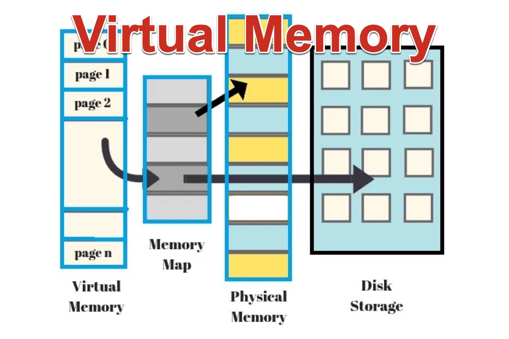

# **Chapter 4: Virtual Memory**

## Overview
This chapter explores the concept of virtual memory in Unix-based operating systems. Virtual memory is a memory management technique that creates an abstraction of the physical memory to provide processes with the illusion of a large, contiguous address space. It allows for more efficient use of hardware, process isolation, and simplified programming models.

Key topics covered in this chapter include:
- The purpose and benefits of virtual memory
- Address translation and paging
- Page tables and memory hierarchy
- Demand paging and page faults
- Swapping and memory protection
- Tools and commands to inspect memory usage

## What is Virtual Memory?
Virtual memory allows each process to believe it has access to its own continuous block of memory, independent of other processes and the physical RAM available. This is achieved through **address translation**, where virtual addresses are mapped to physical addresses by the **Memory Management Unit (MMU)**.

### Benefits of Virtual Memory
- **Process isolation**: Each process operates in its own virtual address space.
- **Efficient memory use**: Not all program parts need to be loaded into RAM at once.
- **Security**: One process cannot directly access another process’s memory.
- **Simplified programming**: Developers can write code as if there's unlimited memory.



## Address Translation and Paging
To support virtual memory, operating systems use **paging**, where memory is divided into fixed-size blocks:
- **Pages**: Blocks in virtual memory.
- **Frames**: Blocks in physical memory.

A **page table** maintains the mapping between pages and frames. Each process has its own page table managed by the OS.

### Translation Process
1. The CPU generates a virtual address.
2. The MMU consults the page table to find the corresponding frame.
3. The frame is used to retrieve the data from physical memory.


### Example: Page Table Entry
A page table entry might contain:

- Frame number
- Present/absent bit
- Access permissions (read/write/execute)
- Dirty bit (modified page)

## Demand Paging and Page Faults
In **demand paging**, only the required pages are loaded into memory. When a page is not present in memory and is needed by a process, a **page fault** occurs.

### Handling a Page Fault
1. The OS suspends the process.
2. It locates the required page on disk (swap space).
3. Loads the page into a free frame.
4. Updates the page table.
5. Resumes the process.


## Swapping and Memory Protection
When memory is full, the OS may **swap out** pages to disk to make room for new ones. Swapping is managed carefully to avoid excessive overhead (known as **thrashing**).

Memory protection ensures that processes do not access each other's memory spaces. This is enforced through permission bits in page tables and by the MMU.

### Example: Memory Layout with Virtual Address Space


Typical layout of a process’s virtual memory:

- **Text segment**: Executable code (read-only)
- **Data segment**: Global/static variables
- **BSS segment**: Uninitialized data
- **Heap**: Dynamically allocated memory (grows upward)
- **Stack**: Function call stack (grows downward)

## 📊 Interactive MicroSim

Explore how virtual addresses are translated to physical memory using this interactive page table simulation:

👉 [Launch the Virtual Memory Mapping MicroSim](../../sims/virtual-memory-mapping/main.html)


## Inspecting Memory Usage
Unix-like systems provide tools to monitor and debug virtual memory:

- `top` / `htop`: Display memory usage of processes
- `vmstat`: Show system memory, CPU, and paging statistics
- `pmap <pid>`: Display memory map of a specific process
- `cat /proc/<pid>/maps`: Detailed memory segment info

### Example:
```sh
pmap 12345
```
Output:
```
12345: ./a.out
0000000000400000     132K r-x-- a.out
0000000000602000       4K rw--- a.out
...
```

## Interactive Quiz
Test your understanding of virtual memory:

1. What is the main benefit of virtual memory?

    **A**. Faster CPU speeds<br>
    **B**. Allows processes to share memory directly<br>
    **C**. Provides process isolation and efficient memory use<br>

??? question "Show Answer"
    The correct answer is **C**. Virtual memory isolates process address spaces and allows efficient use of physical memory.

2. What happens during a page fault?

    **A**. The system reboots<br>
    **B**. A missing page is loaded into memory from disk<br>
    **C**. The process is terminated<br>

??? question "Show Answer"
    The correct answer is **B**. A page fault occurs when a required page is not in memory, prompting the OS to load it from disk.

3. Which command shows memory mappings of a running process?

    **A**. `ls`<br>
    **B**. `ps`<br>
    **C**. `pmap`<br>

??? question "Show Answer"
    The correct answer is **C**. `pmap` displays the memory layout of a given process.

## Summary
- Virtual memory provides an abstraction over physical memory using **paging**.
- Address translation is handled by the **MMU** and page tables.
- **Demand paging** loads memory on demand, triggering **page faults** as needed.
- **Swapping** and **protection mechanisms** help manage and secure memory.
- Tools like `pmap`, `vmstat`, and `/proc` help analyze virtual memory usage.

Virtual memory is a cornerstone of modern OS design, supporting multitasking, stability, and scalability. In the next chapter, we'll explore **Signals**, a lightweight mechanism for inter-process communication and process control.

---
*This chapter is based on material from "Advanced Programming in the UNIX Environment, Third Edition, by W. Richard Stevens and Stephen A. Rago, 2013."*

