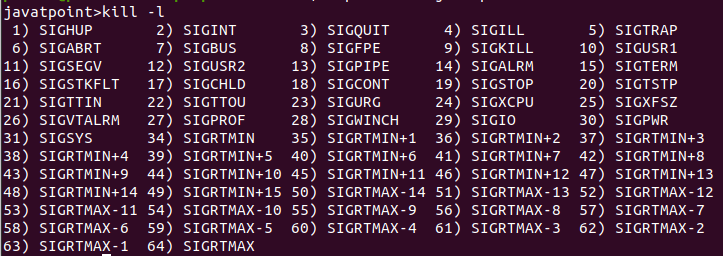
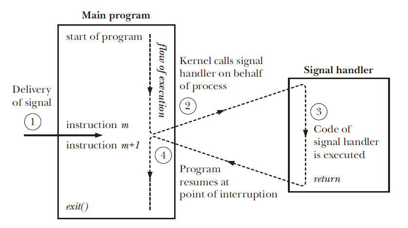

# **Chapter 5: Signals**

## Overview
This chapter introduces **signals**, a fundamental mechanism in Unix-based operating systems for **inter-process communication (IPC)** and **asynchronous event handling**. Signals are software interrupts delivered to a process to notify it of events such as exceptions, user input, or explicit inter-process messages.

Key topics covered in this chapter include:

- What signals are and how they work
- Common standard signals
- Sending and receiving signals
- Signal handlers and default actions
- Blocking, ignoring, and handling signals
- Practical examples and best practices

## What Are Signals?
A **signal** is a limited form of inter-process communication used in Unix systems. It notifies a process that a specific event has occurred. Signals can be generated by the kernel, the user, or another process.

### Characteristics of Signals:
- **Asynchronous**: Signals can be delivered at any time.
- **Lightweight**: No data payload, just an integer ID.
- **Limited scope**: Signals carry no additional information beyond their identifier.



## Common Signals
Some of the most frequently used signals include:

| Signal | Name      | Description                    |
|--------|-----------|--------------------------------|
| 1      | `SIGHUP`  | Hangup detected                |
| 2      | `SIGINT`  | Interrupt from keyboard (Ctrl+C) |
| 9      | `SIGKILL` | Kill signal (cannot be caught) |
| 15     | `SIGTERM` | Termination signal             |
| 17     | `SIGCHLD` | Child process terminated       |
| 18     | `SIGCONT` | Continue process execution     |
| 19     | `SIGSTOP` | Stop (cannot be caught)        |

To view all signals:
```sh
kill -l
```

## 🚦 Interactive MicroSim

Visualize how signals interact with processes — send signals, create parent/child processes, and watch how the process tree evolves in real time:

👉 [Launch the Signals and Process Management MicroSim](../../sims/signals-process/main.html)


## Sending Signals
Signals can be sent using system calls or shell commands.

### Shell Command
```sh
kill -SIGTERM <pid>
```
Or using signal numbers:
```sh
kill -15 <pid>
```

### Programmatically (in C)
```c
#include <signal.h>
kill(pid, SIGTERM);  // Sends SIGTERM to the process with given PID
```

## Handling Signals
By default, each signal has an associated **default action**, which might terminate the process, ignore the signal, or stop/resume the process.

Programs can override these defaults by **installing a signal handler** using the `signal()` or `sigaction()` system call.

### Example: Handling SIGINT
```c
#include <stdio.h>
#include <signal.h>

void handle_sigint(int sig) {
    printf("Caught signal %d\n", sig);
}

int main() {
    signal(SIGINT, handle_sigint);
    while (1) {
        printf("Running...\n");
        sleep(1);
    }
    return 0;
}
```
Run the program and press `Ctrl+C` to see the handler in action.



## Blocking and Ignoring Signals
Processes can choose to **block** or **ignore** specific signals. Blocking a signal prevents it from being delivered until it is unblocked.

### Blocking Example with `sigprocmask()`
```c
#include <signal.h>

sigset_t set;
sigemptyset(&set);
sigaddset(&set, SIGINT);
sigprocmask(SIG_BLOCK, &set, NULL);  // Block SIGINT
```

### Ignoring a Signal
```c
signal(SIGINT, SIG_IGN);  // Ignore SIGINT
```

## Useful Tools and Debugging
- `ps -l`: Shows signal masks of processes
- `kill`: Sends signals to processes
- `trap`: Shell builtin for signal handling in scripts

### Shell Example with `trap`
```sh
trap "echo Caught SIGINT" INT
while true; do sleep 1; done
```

## Interactive Quiz
Test your understanding of signals:

1. What happens when a process receives `SIGKILL`?

    **A**. It handles the signal with a custom function<br>
    **B**. It is forcibly terminated by the OS<br>
    **C**. It ignores the signal<br>

??? question "Show Answer"
    The correct answer is **B**. `SIGKILL` cannot be caught or ignored; it forcibly terminates the process.

2. Which system call installs a signal handler in C?

    **A**. `send()`<br>
    **B**. `signal()`<br>
    **C**. `listen()`<br>

??? question "Show Answer"
    The correct answer is **B**. `signal()` (or `sigaction()` for more control) installs a signal handler.

3. What does the `trap` command do in shell scripting?

    **A**. Blocks all signals<br>
    **B**. Kills background processes<br>
    **C**. Defines actions to take when receiving specific signals<br>

??? question "Show Answer"
    The correct answer is **C**. `trap` lets you handle signals like `SIGINT` in shell scripts.

## Summary
- Signals provide lightweight IPC for notifying processes of events.
- Signals like `SIGINT`, `SIGTERM`, and `SIGKILL` are commonly used to control processes.
- Processes can handle, ignore, or block signals using system calls.
- Shells also support signal handling using the `trap` command.

Signals are a critical building block in Unix systems for responsive, event-driven behavior. In the next chapter, we’ll explore **Pipes**, another mechanism for process communication that allows data exchange between processes.

---
*This chapter is based on material from "Advanced Programming in the UNIX Environment, Third Edition, by W. Richard Stevens and Stephen A. Rago, 2013."*

