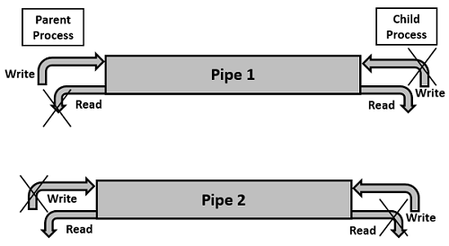

# **Chapter 6: Pipes**

## Overview
This chapter introduces **pipes**, a fundamental inter-process communication (IPC) mechanism in Unix-based operating systems. Pipes allow processes to communicate by passing data from one process’s output to another’s input. They are widely used in command-line environments and systems programming to create modular, efficient workflows.

Key topics covered in this chapter include:

- What pipes are and how they work
- Anonymous vs. named pipes (FIFOs)
- Creating and using pipes in the shell
- Using pipes in C programs
- Synchronization and limitations
- Practical examples and debugging

## What Are Pipes?
A **pipe** is a unidirectional communication channel that connects the output of one process to the input of another. Pipes operate using **file descriptors** and allow for **streaming data** between processes.



### Characteristics of Pipes:

- Unidirectional (one-way data flow)
- Use standard file descriptors (read/write)
- Temporary and exist only while the processes are alive (anonymous)

## Anonymous Pipes in the Shell
Anonymous pipes are created implicitly using the pipe (`|`) operator in the shell.

### Example: Piping Commands
```sh
ls -l | grep ".txt"
```
In this example:
- `ls -l` writes output to the pipe.
- `grep ".txt"` reads input from the pipe.

## Anonymous Pipes in C
In C, you can create an anonymous pipe using the `pipe()` system call. The pipe is represented by two file descriptors:

- `pipefd[0]`: Read end
- `pipefd[1]`: Write end

### Example: Basic Pipe Communication
```c
#include <stdio.h>
#include <unistd.h>

int main() {
    int pipefd[2];
    char buffer[20];

    pipe(pipefd);
    write(pipefd[1], "Hello, pipe!", 12);
    read(pipefd[0], buffer, 12);

    printf("Received: %s\n", buffer);
    return 0;
}
```


## Parent-Child Communication via Pipes
Pipes are often used between a parent and child process created using `fork()`.

### Example: Parent writes, child reads
```c
#include <stdio.h>
#include <unistd.h>
#include <string.h>

int main() {
    int pipefd[2];
    pipe(pipefd);
    pid_t pid = fork();

    if (pid == 0) { // Child
        close(pipefd[1]);
        char msg[20];
        read(pipefd[0], msg, sizeof(msg));
        printf("Child received: %s\n", msg);
    } else { // Parent
        close(pipefd[0]);
        char *msg = "Data from parent";
        write(pipefd[1], msg, strlen(msg) + 1);
    }
    return 0;
}
```

## Named Pipes (FIFOs)
Unlike anonymous pipes, **named pipes** (also known as FIFOs) exist as special files in the filesystem and allow unrelated processes to communicate.

### Creating a FIFO
```sh
mkfifo mypipe
```

### Using a FIFO
```sh
echo "Message" > mypipe &
cat mypipe
```

### In C:
```c
#include <fcntl.h>
#include <sys/stat.h>
#include <unistd.h>

int main() {
    mkfifo("mypipe", 0666);
    int fd = open("mypipe", O_WRONLY);
    write(fd, "Hello FIFO", 10);
    close(fd);
    return 0;
}
```

## Synchronization and Limitations
- Pipes are **blocking by default**: `read()` waits for data, `write()` waits for a reader.
- Pipes have a **limited buffer size**: Writing too much without reading may block.
- Pipes are **unidirectional**: Use two pipes for bidirectional communication.

## Interactive Quiz
Test your understanding of pipes:

1. What does the pipe (`|`) operator do in a Unix shell?

    **A**. Terminates a process<br>
    **B**. Redirects output to a file<br>
    **C**. Sends output of one command as input to another<br>

??? question "Show Answer"
    The correct answer is **C**. The pipe operator connects the `stdout` of one command to the `stdin` of the next.

2. Which system call creates an anonymous pipe in C?

    **A**. `open()`<br>
    **B**. `pipe()`<br>
    **C**. `dup2()`<br>

??? question "Show Answer"
    The correct answer is **B**. The `pipe()` system call creates a unidirectional data channel.

3. What is the main difference between a pipe and a FIFO?

    **A**. Pipes are bidirectional<br>
    **B**. FIFOs exist in the file system and can be used by unrelated processes<br>
    **C**. Pipes allow data to persist after processes terminate<br>

??? question "Show Answer"
    The correct answer is **B**. FIFOs are named files that persist and can be used by unrelated processes.

## Summary
- Pipes allow simple, unidirectional communication between processes.
- Anonymous pipes are used between related processes and created with `pipe()`.
- Named pipes (FIFOs) can connect unrelated processes and exist in the file system.
- Pipes are commonly used for **parent-child communication** and **shell scripting**.

In the next chapter, we will explore **Shared Memory**, a faster and more powerful IPC method that allows multiple processes to access common memory regions.

---
*This chapter is based on material from "Advanced Programming in the UNIX Environment, Third Edition, by W. Richard Stevens and Stephen A. Rago, 2013."*

