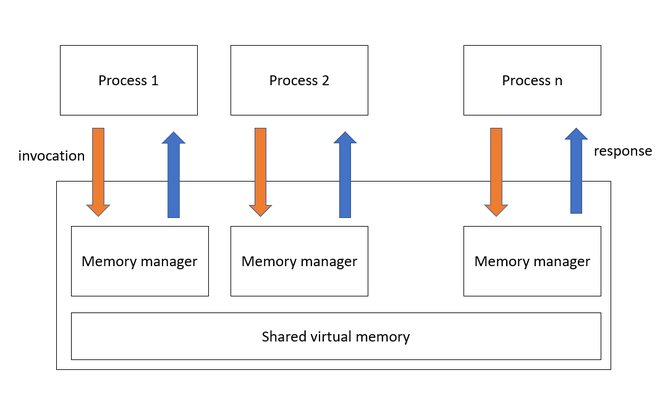
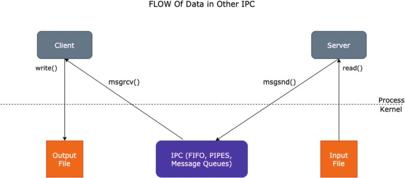

# **Chapter 7: Shared Memory**

## Overview
This chapter explores **shared memory**, one of the most efficient forms of **inter-process communication (IPC)** in Unix-based systems. Shared memory allows multiple processes to access a common memory region, making data exchange extremely fast compared to other IPC methods like pipes or message queues.

Key topics covered in this chapter include:

- What shared memory is and how it works
- Advantages and limitations
- System calls for shared memory
- Creating and accessing shared memory segments
- Synchronization between processes
- Practical C examples and common use cases

## What Is Shared Memory?
Shared memory allows processes to map the same region of physical memory into their virtual address spaces. Once mapped, processes can read from and write to the memory region without invoking the kernel for each operation.



## 🧠 Interactive MicroSim

Explore how shared memory can lead to race conditions and understand how synchronization prevents problems with this detailed visual simulator:

👉 [Launch the Shared Memory Race Condition Visualizer](../../sims/shared-mem-race/main.html)


### Benefits:
- **Speed**: Data is exchanged without kernel intervention after setup.
- **Flexibility**: Ideal for large or frequent data transfers.
- **Efficiency**: Reduces overhead compared to other IPC mechanisms.

### Limitations:
- **Requires synchronization** (e.g., semaphores or mutexes)
- **More complex setup and teardown**

## System Calls for Shared Memory (SysV IPC)
System V shared memory uses the following system calls:

- `shmget()`: Creates or accesses a shared memory segment.
- `shmat()`: Attaches the shared segment to the process's address space.
- `shmdt()`: Detaches the shared segment.
- `shmctl()`: Controls operations on the segment (e.g., remove).

## Example: Creating and Using Shared Memory in C
This example demonstrates how a parent and child process can share memory:

```c
#include <stdio.h>
#include <stdlib.h>
#include <sys/ipc.h>
#include <sys/shm.h>
#include <sys/types.h>
#include <unistd.h>

int main() {
    int shmid;
    char *shmaddr;

    shmid = shmget(IPC_PRIVATE, 1024, IPC_CREAT | 0666);
    if (shmid < 0) {
        perror("shmget");
        exit(1);
    }

    pid_t pid = fork();
    if (pid == 0) {  // Child
        sleep(1);  // Wait for parent to write
        shmaddr = (char *)shmat(shmid, NULL, 0);
        printf("Child read: %s\n", shmaddr);
        shmdt(shmaddr);
    } else {        // Parent
        shmaddr = (char *)shmat(shmid, NULL, 0);
        sprintf(shmaddr, "Hello from parent!");
        shmdt(shmaddr);
        wait(NULL);
        shmctl(shmid, IPC_RMID, NULL);
    }
    return 0;
}
```



## Synchronization and Safety
Shared memory does not provide synchronization by itself. To safely coordinate access:

- Use **semaphores** or **mutexes**.
- Avoid race conditions by locking memory during access.

### Example with Pseudo Code:
```
lock(mutex)
write_to_shared_memory()
unlock(mutex)
```

## POSIX Shared Memory (Alternative)
POSIX provides a simpler API for shared memory via the following functions:

- `shm_open()` and `ftruncate()` to create and size the segment
- `mmap()` to map memory into the address space
- `munmap()` and `shm_unlink()` to clean up

```c
#include <fcntl.h>
#include <sys/mman.h>
#include <unistd.h>
#include <stdio.h>
#include <string.h>

int main() {
    int fd = shm_open("/myshm", O_CREAT | O_RDWR, 0666);
    ftruncate(fd, 4096);
    char *addr = mmap(0, 4096, PROT_READ | PROT_WRITE, MAP_SHARED, fd, 0);
    sprintf(addr, "Hello POSIX shared memory");
    munmap(addr, 4096);
    shm_unlink("/myshm");
    return 0;
}
```

## Interactive Quiz
Test your understanding of shared memory:

1. What is a key advantage of shared memory over pipes?

    **A**. Shared memory is slower<br>
    **B**. Shared memory supports signal handling<br>
    **C**. Shared memory enables faster data exchange<br>

    ??? question "Show Answer"
        The correct answer is **C**. Shared memory allows fast, direct access to memory without kernel mediation.

2. What function attaches a SysV shared memory segment?

    **A**. `shmctl()`<br>
    **B**. `shmat()`<br>
    **C**. `shmget()`<br>

    ??? question "Show Answer"
        The correct answer is **B**. `shmat()` attaches the shared memory segment to the process’s address space.

3. Which API is used for POSIX shared memory?

    **A**. `open()` and `read()`<br>
    **B**. `shmget()` and `shmat()`<br>
    **C**. `shm_open()` and `mmap()`<br>

    ??? question "Show Answer"
        The correct answer is **C**. POSIX shared memory uses `shm_open()` and `mmap()` for memory management.

## Summary
- Shared memory enables **efficient IPC** by allowing multiple processes to access the same memory.
- **SysV** and **POSIX** are two main shared memory APIs.
- **Synchronization** (e.g., semaphores) is essential for safe usage.
- Shared memory is ideal for high-performance applications and concurrent processing.

In the next chapter, we will explore **Sockets and Communication**, which enable communication between processes across systems or networks.

---
*This chapter is based on material from "Advanced Programming in the UNIX Environment, Third Edition, by W. Richard Stevens and Stephen A. Rago, 2013."*

