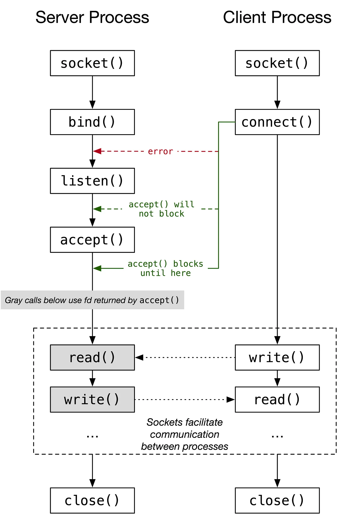

# **Chapter 8: Sockets and Communication**

## Overview
This chapter introduces **sockets**, a powerful inter-process communication (IPC) mechanism that enables data exchange between processes over a **network** or locally on the same system. Sockets are the foundation of modern network programming and are used to implement protocols like **TCP** and **UDP**.

Key topics covered in this chapter include:

- What sockets are and how they work
- TCP vs. UDP sockets
- Creating client-server programs in C
- Using `socket()`, `bind()`, `listen()`, `accept()`, `connect()`
- Socket address structures
- Example code and debugging tools

## What Are Sockets?
A **socket** is an abstraction representing an endpoint for communication. A pair of sockets forms a communication channel. Sockets can be used for:

- **Inter-machine communication** (across networks)
- **Local IPC** (via Unix domain sockets)


### Socket Types
| Type | Protocol | Characteristics |
|------|----------|------------------|
| `SOCK_STREAM` | TCP | Reliable, connection-oriented |
| `SOCK_DGRAM` | UDP | Unreliable, connectionless |
| `SOCK_SEQPACKET` | Sequenced packets (rarely used) | Connection-oriented with message boundaries |

## TCP vs. UDP
| Feature | TCP | UDP |
|--------|-----|-----|
| Reliability | ✔ Yes | ✘ No |
| Connection | ✔ Required (`connect`) | ✘ Not required |
| Ordered Delivery | ✔ Yes | ✘ No guarantee |
| Speed | Slower | Faster |
| Use Case | Web, Email, File Transfer | DNS, Streaming, Gaming |

## Creating a TCP Server in C
```c
#include <stdio.h>
#include <string.h>
#include <sys/socket.h>
#include <netinet/in.h>
#include <unistd.h>

int main() {
    int server_fd, client_fd;
    struct sockaddr_in addr;
    char buffer[1024] = {0};

    server_fd = socket(AF_INET, SOCK_STREAM, 0);
    addr.sin_family = AF_INET;
    addr.sin_addr.s_addr = INADDR_ANY;
    addr.sin_port = htons(8080);

    bind(server_fd, (struct sockaddr *)&addr, sizeof(addr));
    listen(server_fd, 5);
    client_fd = accept(server_fd, NULL, NULL);

    read(client_fd, buffer, 1024);
    printf("Received: %s\n", buffer);
    write(client_fd, "Hello from server", 18);

    close(client_fd);
    close(server_fd);
    return 0;
}
```

## Creating a TCP Client in C
```c
#include <stdio.h>
#include <string.h>
#include <sys/socket.h>
#include <netinet/in.h>
#include <arpa/inet.h>
#include <unistd.h>

int main() {
    int sock = socket(AF_INET, SOCK_STREAM, 0);
    struct sockaddr_in addr;

    addr.sin_family = AF_INET;
    addr.sin_port = htons(8080);
    inet_pton(AF_INET, "127.0.0.1", &addr.sin_addr);

    connect(sock, (struct sockaddr *)&addr, sizeof(addr));
    send(sock, "Hello server", 12, 0);

    char buffer[1024] = {0};
    read(sock, buffer, 1024);
    printf("Server replied: %s\n", buffer);

    close(sock);
    return 0;
}
```

## Socket System Calls
- `socket()`: Creates a new socket.
- `bind()`: Binds socket to a local address.
- `listen()`: Prepares socket to accept incoming connections.
- `accept()`: Accepts a connection from a client.
- `connect()`: Connects to a server.
- `read()` / `write()` / `recv()` / `send()`: Communication functions.
- `close()`: Closes the socket.



## Address Structures
Sockets use `struct sockaddr_in` for IPv4:
```c
struct sockaddr_in {
    short sin_family;      // Address family (AF_INET)
    unsigned short sin_port;  // Port number
    struct in_addr sin_addr;  // IP address
};
```

Use `inet_pton()` to convert a string IP address into binary:
```c
inet_pton(AF_INET, "127.0.0.1", &addr.sin_addr);
```

## Debugging and Tools
- `netstat -an`: View open ports and socket states
- `lsof -i`: List processes using network sockets
- `nc` (netcat): Simple client/server testing
- `tcpdump` or `wireshark`: Packet sniffing tools

## Interactive Quiz
Test your understanding of sockets:

1. What does `socket(AF_INET, SOCK_STREAM, 0)` create?

    **A**. A UDP socket<br>
    **B**. A TCP socket<br>
    **C**. A raw socket<br>

    ??? question "Show Answer"
        The correct answer is **B**. `SOCK_STREAM` with `AF_INET` creates a TCP socket.

2. Which function is used by a server to wait for a connection?

    **A**. `connect()`<br>
    **B**. `accept()`<br>
    **C**. `recv()`<br>

    ??? question "Show Answer"
        The correct answer is **B**. The server uses `accept()` to wait for a client connection.

3. What is the main difference between TCP and UDP?

    **A**. UDP is more reliable<br>
    **B**. TCP is connectionless<br>
    **C**. TCP guarantees delivery, UDP does not<br>

    ??? question "Show Answer"
        The correct answer is **C**. TCP ensures reliable delivery; UDP does not.

## Summary
- Sockets provide flexible and powerful IPC for local and network communication.
- TCP is reliable and connection-based; UDP is faster but connectionless.
- System calls like `socket()`, `bind()`, `accept()`, and `connect()` manage socket communication.
- Understanding the socket lifecycle is essential for building robust network programs.

In the next chapter, we’ll explore **TCP & UDP** in greater depth, comparing their APIs, performance, and real-world use cases.

---
*This chapter is based on material from "Advanced Programming in the UNIX Environment, Third Edition, by W. Richard Stevens and Stephen A. Rago, 2013."*

