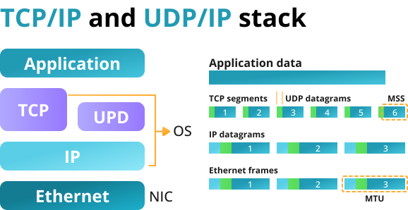

# **Chapter 9: TCP & UDP**

## Overview
This chapter explores **TCP (Transmission Control Protocol)** and **UDP (User Datagram Protocol)**, the two primary transport-layer protocols used in network programming. Understanding their differences, behavior, and appropriate use cases is essential for building reliable and efficient networked applications.

Key topics covered in this chapter include:

- Introduction to TCP and UDP
- Protocol features and differences
- Socket programming with TCP vs. UDP
- Packet structure and communication flow
- When to use TCP or UDP
- Examples in C and common debugging tools

## Introduction to TCP and UDP
TCP and UDP are protocols used for sending data over networks. They sit above the IP layer in the protocol stack and differ primarily in how they handle **reliability**, **ordering**, and **connection management**.



## TCP: Transmission Control Protocol
TCP is a **connection-oriented**, **reliable**, and **stream-based** protocol. It ensures data is delivered in order and without duplication.

### Key TCP Features:

- Connection establishment (3-way handshake)
- Reliable delivery with acknowledgments
- Flow and congestion control
- Ordered byte stream

### TCP Communication Flow:

1. **Client** calls `connect()` to initiate communication.
2. **Server** calls `listen()` and `accept()` to establish the connection.
3. Data is exchanged using `send()` and `recv()`.
4. The connection is closed using `close()`.


## UDP: User Datagram Protocol
UDP is a **connectionless**, **unreliable**, and **message-based** protocol. It is suitable for applications where speed is critical and some data loss is acceptable.

### Key UDP Features:

- No connection setup
- No guarantee of delivery or order
- Low overhead and latency
- Messages (datagrams) are sent as discrete packets

### UDP Communication Flow:

1. No connection is established.
2. Data is sent with `sendto()` and received with `recvfrom()`.


## TCP vs. UDP Comparison
| Feature | TCP | UDP |
|--------|-----|-----|
| Connection | Yes | No |
| Reliable | Yes | No |
| Ordered | Yes | No |
| Flow Control | Yes | No |
| Overhead | High | Low |
| Use Cases | Web, FTP, Email | DNS, Video Streaming, VoIP |

## TCP Example in C
```c
// TCP Server
int server_fd = socket(AF_INET, SOCK_STREAM, 0);
bind(server_fd, ...);
listen(server_fd, 5);
int client_fd = accept(server_fd, NULL, NULL);
send(client_fd, "TCP Hello", 9, 0);
close(client_fd);
```

## UDP Example in C
```c
// UDP Server
int sockfd = socket(AF_INET, SOCK_DGRAM, 0);
bind(sockfd, ...);
char buffer[1024];
recvfrom(sockfd, buffer, sizeof(buffer), 0, ...);
sendto(sockfd, "UDP Hello", 9, 0, ...);
```

## Choosing Between TCP and UDP
| Application Type | Recommended Protocol |
|------------------|-----------------------|
| File transfer, web services | TCP |
| Real-time video/audio, gaming | UDP |
| Remote shell, email | TCP |
| DNS queries, SNMP | UDP |

### Considerations:

- Use **TCP** when reliability and order are critical.
- Use **UDP** when speed matters more than reliability.

## Debugging and Testing Tools

- `netstat`: View active TCP/UDP connections
- `tcpdump` / `wireshark`: Packet-level analysis
- `nc` (netcat): Test TCP/UDP connections
- `nmap`: Scan for open ports and services

## Interactive Quiz

1. Which protocol guarantees ordered delivery of data?

    **A**. UDP<br>
    **B**. TCP<br>
    **C**. ICMP<br>

    ??? question "Show Answer"
        The correct answer is **B**. TCP provides reliable and ordered delivery.

2. Which function is typically used to send a UDP message in C?

    **A**. `connect()`<br>
    **B**. `sendto()`<br>
    **C**. `write()`<br>

    ??? question "Show Answer"
        The correct answer is **B**. UDP uses `sendto()` and `recvfrom()`.

3. Which protocol would be best for live video streaming?

    **A**. TCP<br>
    **B**. UDP<br>
    **C**. FTP<br>

    ??? question "Show Answer"
        The correct answer is **B**. UDP is often used for real-time streaming where speed is prioritized over reliability.

## Summary
- **TCP** is reliable, connection-oriented, and suited for data integrity.
- **UDP** is fast, connectionless, and suited for real-time applications.
- The choice between TCP and UDP depends on application needs.
- Tools like `netstat`, `tcpdump`, and `nc` help analyze network behavior.

In the next chapter, we’ll dive into **Threads**, a concurrency mechanism that enables parallel execution within a process.

---
*This chapter is based on material from "Advanced Programming in the UNIX Environment, Third Edition, by W. Richard Stevens and Stephen A. Rago, 2013."*

