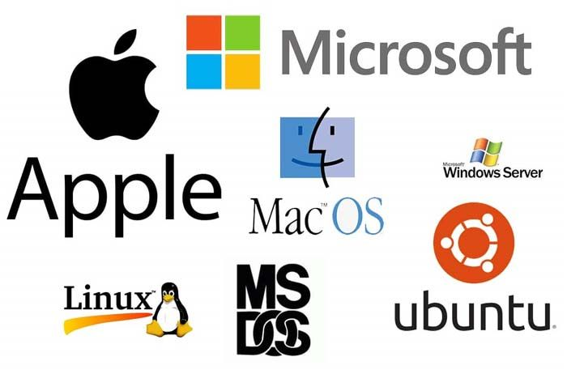

# Introduction to Operating Systems

Welcome! This site will serve as a guide for a collegiate level Introduction to Operating Systems course. 
Much of the features of the site are created with or use an AI model, some of which may reqiure access to one of the
popular LLMs (ChatGPT, Anthropic, Claude, etc.).

Created by Benjamin Lepak

Contact:
lepak036@umn.edu

-------------------------

Welcome to our Intelligent Textbooks with mkdocs material.

This GitHub repository is used in the mkdocs-for-intelligent-texbooks tutoria here:

[Getting Started with Intelligent Textbooks](https://dmccreary.github.io/mkdocs-for-intelligent-textbooks/tutorial/getting-started/)